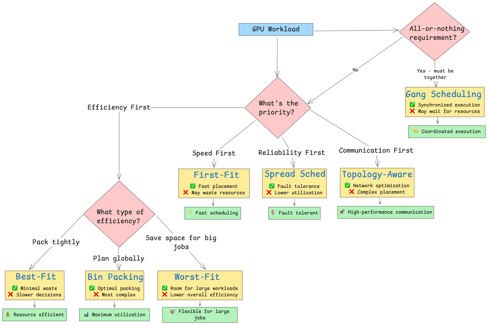

## GPU Scheduling Metaphors

The following CSV maps fun metaphors to real GPU-scheduling algorithms and what they imply for resource allocation:

```csv
Metaphor,Algorithm,"What It Means for GPU Scheduling"
The Quick Host,First-Fit,"Fast, simple, but can waste resources"
The Space Optimizer,Best-Fit,"Efficient packing, but slower to decide"
The Spreader,Worst-Fit,"Leaves room for big jobs, but lowers overall utilization"
The Master Planner,Bin Packing,"Maximizes utilization, best for cost savings"
The Safety Inspector,Spread Scheduling,"Increases fault tolerance, balances heat/load"
The Synchronized Party,Gang Scheduling,"All-or-nothing for distributed jobs"
The VIP Room Manager,Topology-Aware Scheduling,"Optimizes for communication between jobs"

