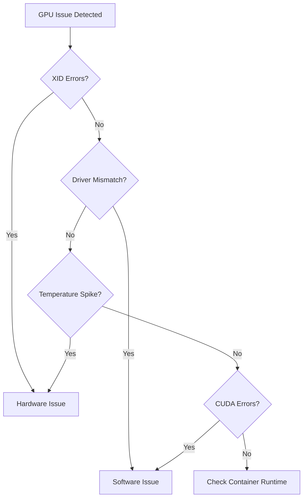
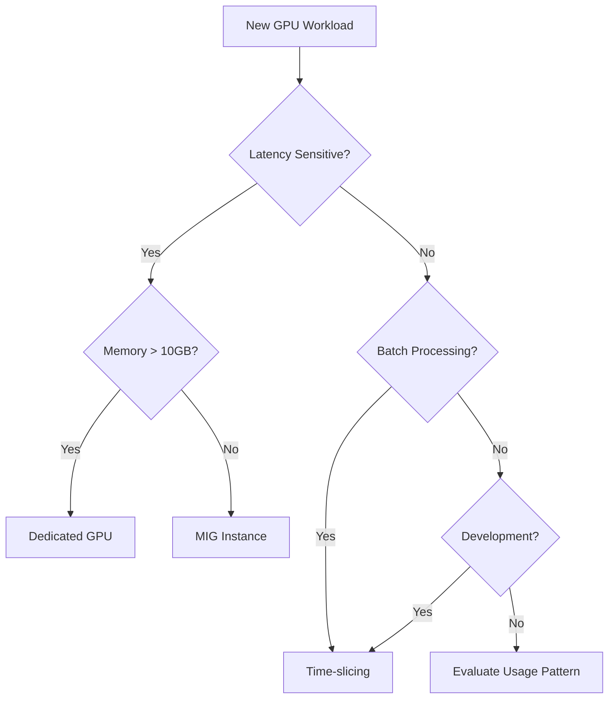

# Kubernetes GPU Allocation Guide for SRE Teams
## A 4-Part Learning Series

---

# Part 1: Kubernetes GPU Foundations & Architecture
*Understanding how Kubernetes manages GPU resources*

## Overview
Before diving into GPU allocation strategies, it's crucial to understand how Kubernetes discovers, manages, and schedules GPU resources. This foundation will help you make informed decisions about allocation strategies.

## Key Learning Objectives
- Understand Kubernetes device plugin architecture
- Learn how GPUs are exposed as resources in Kubernetes
- Master basic GPU scheduling concepts
- Identify key performance considerations

## 1.1 Device Plugin Framework

Kubernetes uses the **device plugin framework** to manage GPUs, providing a standardized way to expose hardware accelerators:

```yaml
# How GPUs appear in Kubernetes
resources:
  limits:
    nvidia.com/gpu: 1  # Requesting one NVIDIA GPU
```

**Key Components:**
- **Device Plugins**: Register with kubelet via gRPC
- **Resource Discovery**: Automatic detection of available GPUs
- **Health Monitoring**: Continuous validation of GPU health
- **Allocation Decisions**: Smart placement of workloads

## 1.2 GPU Resource Types in Kubernetes

Kubernetes supports multiple GPU vendors through their respective device plugins:

| Vendor | Resource Name | Plugin |
|--------|---------------|---------|
| NVIDIA | nvidia.com/gpu | nvidia-device-plugin |
| AMD | amd.com/gpu | k8s-device-plugin |
| Intel | gpu.intel.com/i915 | intel-device-plugin |

## 1.3 Basic GPU Scheduling

**Default Behavior:**
- GPUs are treated as **extended resources**
- Whole GPU allocation only (by default)
- No oversubscription without additional configuration
- First-fit scheduling algorithm

**Critical Performance Metrics:**
- **Context switching overhead**: 25-50 microseconds
- **CUDA context creation**: 1-5 milliseconds
- **Memory fragmentation in shared scenarios**: 15-25%

## 1.4 Hardware Considerations for Kubernetes

Understanding GPU hardware characteristics helps optimize Kubernetes configurations:

**Memory Patterns:**
- Dedicated allocation: <10% fragmentation
- Shared allocation: 15-25% fragmentation
- Memory bandwidth reduction in shared mode: 15-30%

**Performance Trade-offs:**
- Dedicated GPUs: 80-95% utilization for optimized workloads
- Shared GPUs: 60-80% target utilization (accounting for overhead)

## Key Takeaways for Part 1
✅ Kubernetes uses device plugins to manage GPUs as extended resources  
✅ Default allocation is whole GPUs only  
✅ Hardware characteristics drive allocation strategy decisions  
✅ Performance overhead must be considered in scheduling decisions

---

# Part 2: Advanced GPU Sharing Strategies in Kubernetes
*Implementing MIG and Time-slicing for optimal resource utilization*

## Overview
Learn how to move beyond simple whole-GPU allocation to sophisticated sharing strategies that can reduce costs by 60-80% while maintaining performance.

## Key Learning Objectives
- Master Multi-Instance GPU (MIG) configuration
- Implement time-slicing strategies
- Understand trade-offs between sharing approaches
- Configure advanced scheduling policies

## 2.1 Multi-Instance GPU (MIG) Technology

**MIG enables hardware-level GPU partitioning:**
- NVIDIA A100 supports up to **7 isolated instances**
- Each instance has guaranteed memory and compute
- Hardware-level isolation prevents interference

### MIG Configuration Strategies

```yaml
# Example MIG configuration
apiVersion: v1
kind: ConfigMap
metadata:
  name: mig-parted-config
data:
  config.yaml: |
    version: v1
    mig-configs:
      all-1g.5gb:
        - devices: [0,1,2,3]
          mig-enabled: true
          mig-devices:
            "1g.5gb": 7
```

**Three MIG Strategies:**
1. **Single Strategy**: Identical partitioning across all GPUs
2. **Mixed Strategy**: Different profiles per GPU (optimal flexibility)
3. **None Strategy**: Standard GPU exposure

## 2.2 Time-Slicing Implementation

Time-slicing provides software-based GPU sharing:

```yaml
# Time-slicing configuration
apiVersion: v1
kind: ConfigMap
metadata:
  name: time-slicing-config
data:
  any: |-
    version: v1
    flags:
      migStrategy: none
    sharing:
      timeSlicing:
        renameByDefault: false
        failRequestsGreaterThanOne: false
        resources:
        - name: nvidia.com/gpu
          replicas: 4  # Split each GPU into 4 slices
```

**Time-Slicing Characteristics:**
- Enables GPU oversubscription
- No memory or fault isolation
- Uses CUDA round-robin scheduling
- Best for underutilized inference workloads

## 2.3 Scheduling Policies for Shared GPUs

### Quality of Service (QoS) Integration

```yaml
# Guaranteed QoS for critical GPU workloads
apiVersion: v1
kind: Pod
spec:
  containers:
  - name: gpu-app
    resources:
      requests:
        nvidia.com/gpu: 1
        memory: "8Gi"
        cpu: "4"
      limits:
        nvidia.com/gpu: 1
        memory: "8Gi"
        cpu: "4"
```

**QoS Classes for GPU Workloads:**
- **Guaranteed**: Predictable resource access for critical workloads
- **Burstable**: Shared access patterns for development
- **BestEffort**: Testing and experimental workloads

## 2.4 Advanced Scheduling Features

**NUMA-Aware Scheduling:**
```yaml
# Align CPU affinity with GPU NUMA zones
spec:
  nodeSelector:
    nvidia.com/gpu.memory: "40536MiB"
  affinity:
    nodeAffinity:
      requiredDuringSchedulingIgnoredDuringExecution:
        nodeSelectorTerms:
        - matchExpressions:
          - key: nvidia.com/gpu.product
            operator: In
            values: ["NVIDIA-A100-SXM4-40GB"]
```

**Key Advanced Features:**
- Custom schedulers (e.g., Karpenter)
- Topology awareness for multi-GPU systems
- Gang scheduling for distributed workloads
- Priority-based scheduling (10-25% performance improvement)

## Performance Impact Summary

| Strategy | Utilization Improvement | Cost Reduction | Performance Impact |
|----------|------------------------|----------------|-------------------|
| MIG | Up to 7x | 60-80% | <5% overhead |
| Time-slicing | 2-4x | 40-60% | 15-30% overhead |
| Dedicated | 1x (baseline) | 0% | Optimal |

## Key Takeaways for Part 2
✅ MIG provides hardware-isolated GPU sharing with minimal overhead  
✅ Time-slicing enables oversubscription for appropriate workloads  
✅ QoS classes ensure predictable performance for critical applications  
✅ Advanced scheduling features optimize placement and affinity

---

# Part 3: Monitoring and Managing GPU Resources
*Building observability for data-driven allocation decisions*

## Overview
Comprehensive monitoring enables informed decisions about GPU allocation strategies and helps maintain SLAs in production environments.

## Key Learning Objectives
- Deploy GPU monitoring infrastructure
- Configure meaningful alerts
- Troubleshoot common GPU scheduling issues
- Implement capacity planning

## 3.1 Essential GPU Metrics with DCGM

**DCGM (Data Center GPU Manager) provides 50+ metrics:**

```yaml
# Deploy DCGM exporter
apiVersion: apps/v1
kind: DaemonSet
metadata:
  name: dcgm-exporter
spec:
  template:
    spec:
      containers:
      - name: dcgm-exporter
        image: nvcr.io/nvidia/k8s/dcgm-exporter:3.1.3
        env:
        - name: DCGM_EXPORTER_KUBERNETES_GPU_ID_TYPE
          value: "device-name"
```

**Critical Metrics to Monitor:**
- **GPU Utilization**: Target 80-95% for dedicated, 60-80% for shared
- **Memory Usage**: Alert at 85% within 2 minutes
- **Temperature**: Alert immediately at 83°C
- **Power Draw**: Track for capacity planning
- **Queue Depth**: Identify scheduling delays

## 3.2 Grafana Dashboard Configuration

```json
{
  "dashboard": {
    "title": "Kubernetes GPU Allocation Monitor",
    "panels": [
      {
        "title": "GPU Utilization by Node",
        "targets": [{
          "expr": "DCGM_FI_DEV_GPU_UTIL{}"
        }]
      },
      {
        "title": "Memory Bandwidth Saturation",
        "targets": [{
          "expr": "DCGM_FI_DEV_MEM_COPY_UTIL{}"
        }]
      }
    ]
  }
}
```

**Key Dashboard Components:**
- Real-time utilization heatmaps
- Memory bandwidth trends
- Thermal throttling indicators
- Allocation efficiency metrics

## 3.3 Alert Strategy for GPU Resources

```yaml
# Prometheus alert rules
groups:
- name: gpu_alerts
  rules:
  - alert: GPUHighUtilization
    expr: DCGM_FI_DEV_GPU_UTIL > 90
    for: 5m
    annotations:
      summary: "GPU utilization above 90% for 5 minutes"
      
  - alert: GPUMemoryPressure
    expr: DCGM_FI_DEV_FB_USED / DCGM_FI_DEV_FB_TOTAL > 0.85
    for: 2m
    annotations:
      summary: "GPU memory usage above 85%"
      
  - alert: GPUThermalThrottle
    expr: DCGM_FI_DEV_GPU_TEMP > 83
    annotations:
      summary: "GPU temperature exceeding safe threshold"
```

## 3.4 Troubleshooting Decision Tree

**Hardware vs Software Issues:**



**Common Issues and Solutions:**
- **Resource Conflicts**: Check multi-tenancy configuration
- **Performance Degradation**: Analyze noisy neighbor effects
- **Scheduling Failures**: Verify resource requests and limits
- **Memory Errors**: Validate ECC settings and health

## 3.5 Capacity Planning with Metrics

**7-Day Forecasting Model:**
```python
# Simplified capacity forecast
utilization_trend = linear_regression(
    x=time_points_24h_avg,
    y=gpu_utilization_values
)
forecast_7d = utilization_trend.predict(next_7_days)
```

**Capacity Planning Indicators:**
- Growth rate calculations
- Seasonal pattern detection
- Resource saturation predictions
- Cost optimization opportunities

## Key Takeaways for Part 3
✅ DCGM provides comprehensive GPU observability  
✅ Proactive alerting prevents SLA breaches  
✅ Systematic troubleshooting reduces MTTR  
✅ Data-driven capacity planning optimizes costs

---

# Part 4: Production Decision Framework
*Choosing the right GPU allocation strategy for your workloads*

## Overview
Learn how to analyze workloads, evaluate trade-offs, and implement GPU allocation strategies that balance performance, cost, and reliability.

## Key Learning Objectives
- Characterize workloads for allocation decisions
- Perform cost-benefit analysis
- Implement risk assessment frameworks
- Build migration strategies

## 4.1 Workload Characterization Matrix

| Workload Type | Characteristics | Recommended Strategy | Rationale |
|---------------|-----------------|---------------------|-----------|
| Training (DL) | High memory, long duration | Dedicated GPU | Predictable performance critical |
| Inference (Batch) | Moderate memory, periodic | Time-slicing | Cost optimization opportunity |
| Inference (Real-time) | Low latency requirement | MIG or Dedicated | Isolation prevents jitter |
| Development | Variable patterns | Time-slicing | Maximum flexibility |
| HPC Simulation | High compute, NUMA-sensitive | Dedicated + Affinity | Performance optimization |

## 4.2 Cost Analysis Framework

**Total Cost of Ownership (TCO) Calculation:**

```
TCO = Hardware Cost + Power Cost + Operational Overhead + Opportunity Cost

Where:
- Hardware Cost: $10-100K per GPU
- Power Cost: 300-700W × $0.10/kWh × 8760 hours
- Operational Overhead: 20-30% of hardware annually
- Opportunity Cost: Value of unused capacity
```

**Strategy Cost Comparison:**
- **Dedicated**: 2-4x higher infrastructure costs
- **MIG**: 60-80% cost reduction through 7x utilization
- **Time-slicing**: 40-60% cost reduction

## 4.3 SLA-Driven Resource Planning

```yaml
# SLA mapping to resource requirements
sla_requirements:
  tier1_realtime:
    latency_p99: 10ms
    availability: 99.99%
    strategy: dedicated_gpu
    
  tier2_batch:
    throughput: 1000_req/min
    availability: 99.9%
    strategy: mig_2g.10gb
    
  tier3_development:
    best_effort: true
    strategy: time_slicing_4x
```

**Decision Criteria:**
- **Latency SLAs** → GPU memory bandwidth requirements
- **Throughput SLAs** → Compute core allocation
- **Availability Requirements** → Redundancy strategy
- **Isolation Requirements** → MIG vs time-slicing

## 4.4 Risk Assessment and Mitigation

**Risk Matrix for GPU Sharing:**

| Risk Type | Impact | Probability | Mitigation Strategy |
|-----------|---------|-------------|-------------------|
| Noisy Neighbor | 10-30% performance variance | High (shared) | MIG isolation |
| Resource Contention | Service degradation | Medium | Resource limits |
| Hardware Failure | Multiple workload impact | Low | Blast radius limiting |
| Security (side-channel) | Data exposure | Low | Namespace isolation |

## 4.5 Implementation Roadmap

**Phase 1: Assessment (2 weeks)**
- Profile existing workloads
- Identify optimization candidates
- Establish baseline metrics

**Phase 2: Pilot (4 weeks)**
- Deploy test workloads with MIG/time-slicing
- Monitor performance impact
- Validate cost savings

**Phase 3: Production Rollout (8 weeks)**
- Gradual migration by workload tier
- Continuous monitoring and optimization
- Documentation and training

## 4.6 Decision Tree for GPU Allocation



## Production Best Practices

1. **Start Conservative**: Begin with dedicated allocation for critical workloads
2. **Monitor Extensively**: Establish baselines before sharing
3. **Test Thoroughly**: Validate performance under realistic conditions
4. **Document Decisions**: Maintain allocation strategy rationale
5. **Review Regularly**: Quarterly assessment of allocation effectiveness

## Key Takeaways for Part 4
✅ Workload characteristics drive allocation strategy selection  
✅ TCO analysis quantifies the 60-80% cost savings potential  
✅ SLA requirements map directly to technical implementation  
✅ Systematic migration reduces production risk

---

## Summary: Mastering Kubernetes GPU Allocation

This 4-part series equips SRE teams with the knowledge to:

1. **Understand** how Kubernetes manages GPU resources through device plugins
2. **Implement** advanced sharing strategies using MIG and time-slicing
3. **Monitor** GPU utilization and performance effectively
4. **Decide** on optimal allocation strategies based on workload requirements

**Key Success Metrics:**
- 🎯 15-30% performance impact understanding
- 💰 60-80% potential cost reduction
- 📊 Comprehensive monitoring coverage
- 🚀 Data-driven allocation decisions

Remember: The choice between dedicated and shared GPU allocation significantly impacts both performance and cost. Use this framework to make informed decisions that balance your specific requirements.


From this i will expand each topic into sub sections and dive deep then create byte sized information to post the content.