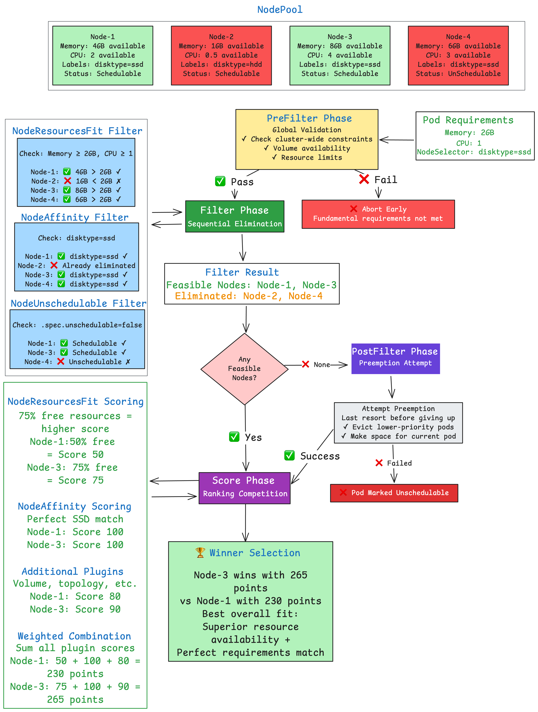

# Kubernetes Scheduler Decision Flow

This document outlines the internal phases of the Kubernetes **scheduling framework** using a real-world scenario: scheduling a pod with specific resource and affinity requirements across a set of heterogeneous nodes.

---

## 1. 📝 Input Phase

- **Pod Requirements**:
  - 2GB Memory
  - 1 CPU
  - SSD Disk

- **Available Nodes**:
  - 4 nodes with varying resources and constraints

---

## 2. 🔍 PreFilter Phase

- **Purpose**:
  - Perform **global validations** before evaluating individual nodes.

- **Outcome**:
  - Aborts early if cluster-wide constraints (e.g., quota limits) are violated.

---

## 3. 🚫 Filter Phase (Sequential Elimination)

Each plugin filters out nodes that don’t meet the pod’s criteria:

| Plugin             | Action                                             |
|--------------------|----------------------------------------------------|
| `NodeResourcesFit` | **Eliminates Node-2**: Insufficient memory         |
| `NodeAffinity`     | Checks for SSD requirement on remaining nodes      |
| `NodeUnschedulable`| **Eliminates Node-4**: Marked as unschedulable     |

- **Feasible Nodes After Filtering**:
  - ✅ Node-1
  - ✅ Node-3

---

## 4. 🧹 PostFilter Phase (Preemption)

- **When it triggers**:
  - **Only** when **no nodes** pass the Filter phase.

- **What it does**:
  - Attempts **preemption**: evicting lower-priority pods to make room.

- **Outcome**:
  - If successful, continues to scoring.
  - If not, pod is marked **unschedulable**.

---

## 5. 🧮 Score Phase (Ranking Competition)

Remaining nodes are ranked using multiple scoring plugins:

| Plugin             | Node-1 Score | Node-3 Score |
|--------------------|--------------|---------------|
| `NodeResourcesFit` | 50% free     | 75% free      |
| `NodeAffinity`     | 100          | 100           |
| `Volume/Topology`  | Favorable    | Highly Favorable |

- **Final Score (Weighted)**:
  - Node-1: **230 points**
  - Node-3: **265 points**

---

## 6. 🏆 Winner Selection

- **Selected Node**: **Node-3**
- **Reason**: 
  - Higher overall score due to better resource availability and perfect SSD match.
- **Next Step**: Proceeds to **binding phase** to finalize scheduling.

---

## 📘 Summary

Kubernetes uses a **multi-phase scheduling pipeline** that includes validation, elimination, scoring, and preemption. This process ensures pods land on the most suitable node — optimizing for both resource fit and policy compliance.

