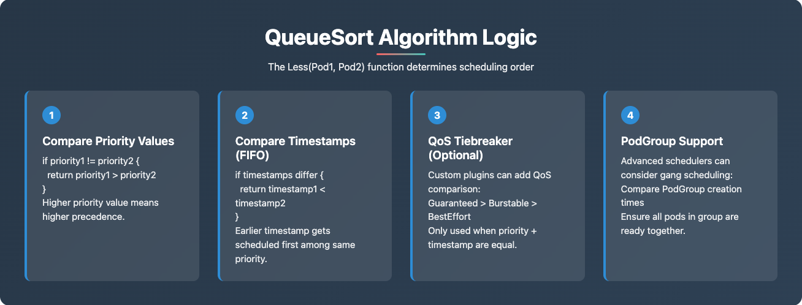
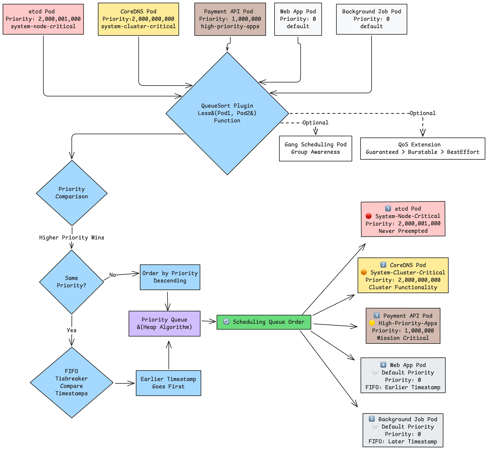

QueueSort Algorithm Logic:

Priority Comparison: Higher numeric values always win
FIFO Tiebreaker: Same priority → earliest timestamp first
QoS Extension: Custom plugins can add Quality of Service logic
Gang Scheduling: Advanced plugins group related pods

Key Technical Insights:

Only ONE QueueSort plugin can be active at a time
Less(Pod1, Pod2) function determines ordering using heap algorithm
Priority values are limited to 1 billion for user pods (2B+ reserved for system)
Preemption is separate from queue ordering (happens in PostFilter phase)
Custom plugins can extend sorting logic for gang scheduling, QoS, business metrics

This shows how Kubernetes's priority system isn't just about "important vs unimportant" - it's a sophisticated traffic management system that ensures cluster stability during crises, efficient resource utilization during normal operations, and business continuity during high-load events.

