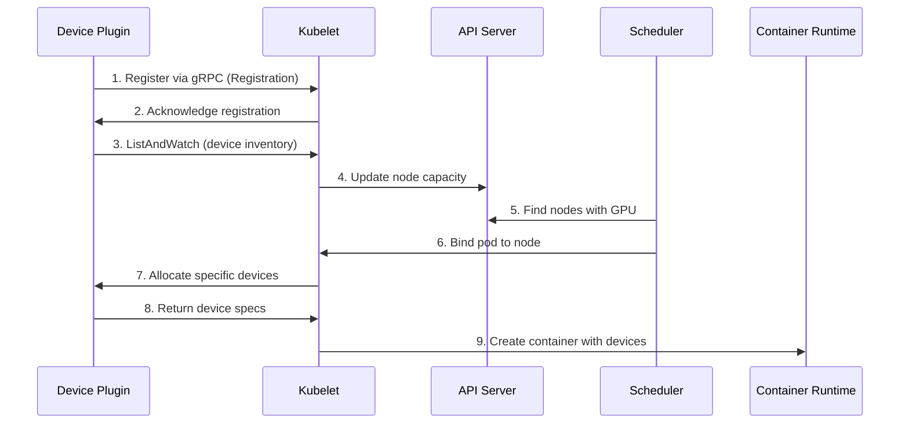

# Deep Dive: Kubernetes GPU Foundations & Device Plugin Architecture

## Table of Contents
1. [Device Plugin Architecture Deep Dive](#device-plugin-architecture-deep-dive)
2. [GPU vs CPU/Memory: Fundamental Resource Differences](#gpu-vs-cpumemory-fundamental-resource-differences)
3. [GPU Scheduling Algorithms Explained](#gpu-scheduling-algorithms-explained)
4. [Implementation Details and Best Practices](#implementation-details-and-best-practices)

---

## Device Plugin Architecture Deep Dive

### Understanding the Device Plugin Framework

The Kubernetes device plugin framework is a sophisticated mechanism that enables the kubelet to discover and manage specialized hardware devices like GPUs, FPGAs, and other accelerators. Unlike CPU and memory which are native Kubernetes resources, GPUs require this plugin architecture to be properly integrated into the cluster.

### How Device Plugins Work: The Complete Flow



### Detailed Device Plugin Lifecycle

#### 1. Registration Phase
```go
// Device plugin registers with kubelet
service Registration {
    rpc Register(RegisterRequest) returns (Empty) {}
}

message RegisterRequest {
    string version = 1;  // v1beta1
    string endpoint = 2; // unix:///var/lib/kubelet/device-plugins/nvidia.sock
    string resource_name = 3; // nvidia.com/gpu
    DevicePluginOptions options = 4;
}
```

The device plugin initiates registration by:
- Creating a Unix socket in `/var/lib/kubelet/device-plugins/`
- Calling the kubelet's Registration service
- Providing its resource name (e.g., `nvidia.com/gpu`)

#### 2. Discovery Phase
```go
// Device plugin must implement this service
service DevicePlugin {
    rpc GetDevicePluginOptions(Empty) returns (DevicePluginOptions) {}
    rpc ListAndWatch(Empty) returns (stream ListAndWatchResponse) {}
    rpc Allocate(AllocateRequest) returns (AllocateResponse) {}
    rpc GetPreferredAllocation(PreferredAllocationRequest) returns (PreferredAllocationResponse) {}
    rpc PreStartContainer(PreStartContainerRequest) returns (PreStartContainerResponse) {}
}
```

**ListAndWatch Implementation:**
```go
func (dp *NvidiaDevicePlugin) ListAndWatch(e *pluginapi.Empty, s pluginapi.DevicePlugin_ListAndWatchServer) error {
    // Initial device discovery
    devices := dp.discoverGPUs()
    s.Send(&pluginapi.ListAndWatchResponse{Devices: devices})
    
    // Continuous health monitoring
    for {
        select {
        case <-dp.health:
            // Device health changed
            devices = dp.getHealthyDevices()
            s.Send(&pluginapi.ListAndWatchResponse{Devices: devices})
        case <-dp.stop:
            return nil
        }
    }
}
```

#### 3. Allocation Phase
When a pod requests a GPU, the allocation flow is:

```go
func (dp *NvidiaDevicePlugin) Allocate(ctx context.Context, reqs *pluginapi.AllocateRequest) (*pluginapi.AllocateResponse, error) {
    responses := pluginapi.AllocateResponse{}
    
    for _, req := range reqs.ContainerRequests {
        response := &pluginapi.ContainerAllocateResponse{
            Envs: map[string]string{
                "NVIDIA_VISIBLE_DEVICES": strings.Join(req.DevicesIDs, ","),
            },
            Devices: []*pluginapi.DeviceSpec{
                {
                    ContainerPath: "/dev/nvidia0",
                    HostPath:      "/dev/nvidia0",
                    Permissions:   "rw",
                },
            },
            Mounts: []*pluginapi.Mount{
                {
                    ContainerPath: "/usr/bin/nvidia-smi",
                    HostPath:      "/usr/bin/nvidia-smi",
                    ReadOnly:      true,
                },
            },
        }
        responses.ContainerResponses = append(responses.ContainerResponses, response)
    }
    
    return &responses, nil
}
```

### Device Health Monitoring

Device plugins continuously monitor device health:

```yaml
# Example health statuses
- ID: "GPU-12345678"
  Health: "Healthy"
  
- ID: "GPU-87654321"  
  Health: "Unhealthy"  # Will not be allocated
  
- ID: "GPU-11111111"
  Health: "Unknown"    # Treated as unhealthy
```

**Health Check Implementation:**
```go
func (dp *NvidiaDevicePlugin) healthcheck() {
    for {
        select {
        case <-dp.stop:
            return
        case <-time.After(10 * time.Second):
            for _, device := range dp.devices {
                // Check GPU health via nvidia-ml
                health := nvml.DeviceGetHealth(device.ID)
                if health != device.Health {
                    device.Health = health
                    dp.health <- true  // Trigger ListAndWatch update
                }
            }
        }
    }
}
```

---

## GPU vs CPU/Memory: Fundamental Resource Differences

### Resource Characteristics Comparison

| Aspect | CPU | Memory | GPU |
|--------|-----|--------|-----|
| **Divisibility** | Millicores (1/1000) | Bytes | Whole units only* |
| **Sharing Model** | Time-sliced by OS | Address space isolation | Exclusive by default |
| **Overcommit** | Supported | Supported (swap) | Not supported** |
| **Isolation** | cgroups/namespaces | cgroups/namespaces | Device assignment |
| **Scheduling** | CFS scheduler | Memory controller | First-fit/Custom |
| **Resource Type** | Native | Native | Extended Resource |
| **Failure Impact** | Process throttling | OOM Kill | Application crash |
| **Context Switch** | ~1-10 μs | N/A | ~25-50 μs |

*Unless using MIG or time-slicing  
**Except with explicit time-slicing configuration

### CPU Resources: Fine-Grained Sharing

```yaml
# CPU can be requested in millicores
resources:
  requests:
    cpu: "250m"  # 0.25 CPU cores
  limits:
    cpu: "500m"  # 0.5 CPU cores
```

**CPU Scheduling in Kubernetes:**
- Uses Linux CFS (Completely Fair Scheduler)
- Automatic time-slicing between processes
- CPU shares = `(cpu_request * 1024) / 1000`
- Throttling when exceeding limits

### Memory Resources: Flexible Allocation

```yaml
# Memory in various units
resources:
  requests:
    memory: "512Mi"  # Mebibytes
  limits:
    memory: "1Gi"    # Gibibytes
```

**Memory Management:**
- Hard limits enforced by cgroups
- OOM killer activates on limit breach
- No time-sharing - physical allocation
- Page-level granularity

### GPU Resources: Discrete Units

```yaml
# GPUs are whole units only
resources:
  limits:
    nvidia.com/gpu: 1  # Can't request 0.5 GPU
```

**Why GPUs are Different:**

1. **Hardware Architecture:**
   - GPUs have dedicated memory (VRAM)
   - Complex state management (CUDA contexts)
   - Hardware scheduling units (SMs)
   
2. **Driver Model:**
   - User-space drivers maintain state
   - Context switching is expensive
   - Memory transfers over PCIe

3. **Programming Model:**
   - CUDA/OpenCL assume exclusive access
   - Kernel launches expect full device
   - Memory allocation is explicit

### Extended Resources vs Native Resources

```go
// Native resources (CPU/Memory) - built into Kubernetes
type ResourceName string

const (
    ResourceCPU    ResourceName = "cpu"
    ResourceMemory ResourceName = "memory"
)

// Extended resources - require device plugins
const (
    ResourceNvidiaGPU ResourceName = "nvidia.com/gpu"
    ResourceAMDGPU    ResourceName = "amd.com/gpu"
)
```

**Key Differences:**
1. **Discovery**: Native resources auto-discovered, extended resources need plugins
2. **Scheduling**: Native resources have complex scheduling, extended resources use simple counting
3. **Isolation**: Native resources use Linux primitives, extended resources use device-specific mechanisms
4. **Accounting**: Native resources have detailed metrics, extended resources have basic counting

---

## GPU Scheduling Algorithms Explained

### First-Fit Scheduling Algorithm

First-fit is the default scheduling approach for GPUs in Kubernetes. It's simple but can lead to suboptimal placement.

```go
// Simplified first-fit implementation
func firstFitGPU(nodes []Node, requestedGPUs int) *Node {
    for _, node := range nodes {
        availableGPUs := node.Status.Capacity["nvidia.com/gpu"] - 
                        node.Status.Allocated["nvidia.com/gpu"]
        
        if availableGPUs >= requestedGPUs {
            return &node  // First node with enough GPUs
        }
    }
    return nil  // No suitable node found
}
```

**Characteristics:**
- ✅ **Pros**: Fast O(n), simple implementation, low overhead
- ❌ **Cons**: Poor GPU utilization, fragmentation, no optimization

**Example Scenario:**
```
Node1: 2/4 GPUs used
Node2: 0/4 GPUs used
Node3: 1/4 GPUs used

Request: 2 GPUs
First-fit result: Node1 (first with 2 free)
Optimal choice: Node2 (better consolidation)
```

### Best-Fit Scheduling Algorithm

Best-fit minimizes wasted resources by finding the node with the least sufficient resources.

```go
func bestFitGPU(nodes []Node, requestedGPUs int) *Node {
    var bestNode *Node
    minWaste := int(^uint(0) >> 1)  // Max int
    
    for _, node := range nodes {
        availableGPUs := node.Status.Capacity["nvidia.com/gpu"] - 
                        node.Status.Allocated["nvidia.com/gpu"]
        
        if availableGPUs >= requestedGPUs {
            waste := availableGPUs - requestedGPUs
            if waste < minWaste {
                minWaste = waste
                bestNode = &node
            }
        }
    }
    return bestNode
}
```

**Characteristics:**
- ✅ **Pros**: Better utilization, reduces fragmentation
- ❌ **Cons**: O(n) complexity, may create many small fragments

### Worst-Fit Scheduling Algorithm

Worst-fit selects the node with the most available resources, leaving room for future large requests.

```go
func worstFitGPU(nodes []Node, requestedGPUs int) *Node {
    var bestNode *Node
    maxAvailable := 0
    
    for _, node := range nodes {
        availableGPUs := node.Status.Capacity["nvidia.com/gpu"] - 
                        node.Status.Allocated["nvidia.com/gpu"]
        
        if availableGPUs >= requestedGPUs && availableGPUs > maxAvailable {
            maxAvailable = availableGPUs
            bestNode = &node
        }
    }
    return bestNode
}
```

**Characteristics:**
- ✅ **Pros**: Leaves large contiguous spaces, good for variable workloads
- ❌ **Cons**: Poor consolidation, higher infrastructure costs

### Bin Packing Algorithm

Bin packing aims to minimize the number of nodes used, improving consolidation.

```go
func binPackingGPU(nodes []Node, requests []PodRequest) map[*Node][]PodRequest {
    // Sort nodes by available GPU capacity (ascending)
    sort.Slice(nodes, func(i, j int) bool {
        return getAvailableGPUs(nodes[i]) < getAvailableGPUs(nodes[j])
    })
    
    // Sort requests by GPU requirement (descending)
    sort.Slice(requests, func(i, j int) bool {
        return requests[i].GPUs > requests[j].GPUs
    })
    
    allocation := make(map[*Node][]PodRequest)
    
    for _, req := range requests {
        // Try to fit in the fullest node that has space
        for i := range nodes {
            if getAvailableGPUs(nodes[i]) >= req.GPUs {
                allocation[&nodes[i]] = append(allocation[&nodes[i]], req)
                nodes[i].Status.Allocated["nvidia.com/gpu"] += req.GPUs
                break
            }
        }
    }
    
    return allocation
}
```

**Characteristics:**
- ✅ **Pros**: Excellent consolidation, cost-effective
- ❌ **Cons**: Complex implementation, may delay scheduling

### Spread Scheduling Algorithm

Spread scheduling distributes workloads evenly across nodes for reliability.

```go
func spreadSchedulingGPU(nodes []Node, requestedGPUs int) *Node {
    // Calculate utilization ratio for each node
    type nodeUtil struct {
        node *Node
        utilization float64
    }
    
    var candidates []nodeUtil
    
    for i := range nodes {
        available := getAvailableGPUs(nodes[i])
        if available >= requestedGPUs {
            total := nodes[i].Status.Capacity["nvidia.com/gpu"]
            used := nodes[i].Status.Allocated["nvidia.com/gpu"]
            utilization := float64(used) / float64(total)
            
            candidates = append(candidates, nodeUtil{
                node: &nodes[i],
                utilization: utilization,
            })
        }
    }
    
    // Select node with lowest utilization
    if len(candidates) > 0 {
        sort.Slice(candidates, func(i, j int) bool {
            return candidates[i].utilization < candidates[j].utilization
        })
        return candidates[0].node
    }
    
    return nil
}
```

**Characteristics:**
- ✅ **Pros**: Better fault tolerance, thermal distribution
- ❌ **Cons**: Lower utilization, higher costs

### Advanced GPU-Aware Scheduling

Modern GPU schedulers consider additional factors:

#### 1. **Topology-Aware Scheduling**
```yaml
# Consider GPU interconnects (NVLink, PCIe)
apiVersion: v1
kind: Pod
metadata:
  annotations:
    nvidia.com/gpu-topology: "nvlink"  # Prefer NVLink-connected GPUs
spec:
  containers:
  - name: multi-gpu-app
    resources:
      limits:
        nvidia.com/gpu: 2
```

#### 2. **Affinity-Based Scheduling**
```yaml
# Co-locate with specific GPU types
spec:
  affinity:
    nodeAffinity:
      requiredDuringSchedulingIgnoredDuringExecution:
        nodeSelectorTerms:
        - matchExpressions:
          - key: nvidia.com/gpu.product
            operator: In
            values: ["Tesla-V100-SXM2-32GB"]
```

#### 3. **Gang Scheduling**
```go
// Schedule all pods together or none
func gangScheduleGPU(nodes []Node, podGroup []Pod) *SchedulingDecision {
    requiredGPUs := 0
    for _, pod := range podGroup {
        requiredGPUs += pod.Spec.Resources.Limits["nvidia.com/gpu"]
    }
    
    // Find nodes that can accommodate entire group
    for _, node := range nodes {
        if getAvailableGPUs(node) >= requiredGPUs {
            return &SchedulingDecision{
                Node: node,
                Pods: podGroup,
                Success: true,
            }
        }
    }
    
    // Try to split across multiple nodes with constraints
    return attemptMultiNodeGangSchedule(nodes, podGroup)
}
```

### Performance Impact of Scheduling Algorithms

| Algorithm | GPU Utilization | Scheduling Latency | Fragmentation | Use Case |
|-----------|----------------|-------------------|---------------|----------|
| First-Fit | 40-60% | <1ms | High | Development |
| Best-Fit | 70-85% | 1-5ms | Medium | General purpose |
| Worst-Fit | 30-50% | 1-5ms | Low | Variable workloads |
| Bin Packing | 85-95% | 10-50ms | Very Low | Cost optimization |
| Spread | 50-70% | 5-10ms | Medium | HA workloads |
| Topology-Aware | 60-80% | 10-30ms | Low | Multi-GPU apps |

---

## Implementation Details and Best Practices

### Custom GPU Scheduler Implementation

```go
// Custom GPU scheduler with multi-factor scoring
type GPUScheduler struct {
    clientset  kubernetes.Interface
    nodeLister listers.NodeLister
    podLister  listers.PodLister
}

func (s *GPUScheduler) Schedule(pod *v1.Pod) (string, error) {
    nodes, err := s.nodeLister.List(labels.Everything())
    if err != nil {
        return "", err
    }
    
    // Score each node
    nodeScores := make(map[string]int)
    for _, node := range nodes {
        score := 0
        
        // Factor 1: Available GPUs
        score += s.scoreGPUAvailability(node, pod) * 40
        
        // Factor 2: GPU type match
        score += s.scoreGPUType(node, pod) * 30
        
        // Factor 3: Topology considerations
        score += s.scoreTopology(node, pod) * 20
        
        // Factor 4: Node utilization
        score += s.scoreUtilization(node) * 10
        
        nodeScores[node.Name] = score
    }
    
    // Select highest scoring node
    return s.selectBestNode(nodeScores), nil
}
```

### Debugging GPU Scheduling Issues

```bash
# Check device plugin status
kubectl get nodes -o json | jq '.items[].status.allocatable'

# Verify device plugin pods
kubectl get pods -n kube-system | grep device-plugin

# Check device plugin logs
kubectl logs -n kube-system nvidia-device-plugin-ds-xxxxx

# Inspect node capacity
kubectl describe node gpu-node-1 | grep -A5 "Allocated resources"

# Debug scheduling decisions
kubectl get events --field-selector reason=FailedScheduling
```

### Common Issues and Solutions

1. **GPUs Not Visible**
```bash
# Verify device plugin registration
ls -la /var/lib/kubelet/device-plugins/

# Check kubelet logs
journalctl -u kubelet | grep -i device
```

2. **Scheduling Failures**
```yaml
# Add scheduling logs
apiVersion: v1
kind: ConfigMap
metadata:
  name: scheduler-config
data:
  config.yaml: |
    apiVersion: kubescheduler.config.k8s.io/v1
    profiles:
    - schedulerName: gpu-scheduler
      pluginConfig:
      - name: DefaultPreemption
        args:
          verbosity: 10  # Debug logging
```

3. **Resource Fragmentation**
```go
// Implement defragmentation logic
func (s *GPUScheduler) defragmentGPUs() {
    // Identify fragmented nodes
    fragmentedNodes := s.identifyFragmentedNodes()
    
    // Migrate pods to consolidate GPUs
    for _, node := range fragmentedNodes {
        s.consolidatePods(node)
    }
}
```

### Best Practices Summary

1. **Choose the Right Algorithm**
   - Development: First-fit for simplicity
   - Production: Bin packing for cost efficiency
   - Critical workloads: Spread for reliability

2. **Monitor Scheduling Metrics**
   - GPU utilization per node
   - Scheduling latency
   - Failed scheduling events
   - Resource fragmentation

3. **Implement Custom Scheduling**
   - For specific topology requirements
   - When default scheduler insufficient
   - To optimize for your workload patterns

4. **Regular Maintenance**
   - Update device plugins
   - Monitor GPU health
   - Rebalance workloads periodically
   - Clean up failed allocations

## Conclusion

Understanding the device plugin architecture and GPU scheduling algorithms is crucial for effective GPU resource management in Kubernetes. The fundamental differences between GPUs and traditional resources like CPU/memory require specialized handling, and choosing the right scheduling algorithm can significantly impact both performance and cost.

Key takeaways:
- Device plugins provide a sophisticated mechanism for GPU integration
- GPUs require different handling than CPU/memory due to hardware constraints
- Scheduling algorithm choice impacts utilization by 40-95%
- Custom schedulers enable workload-specific optimizations
- Monitoring and maintenance are essential for production success