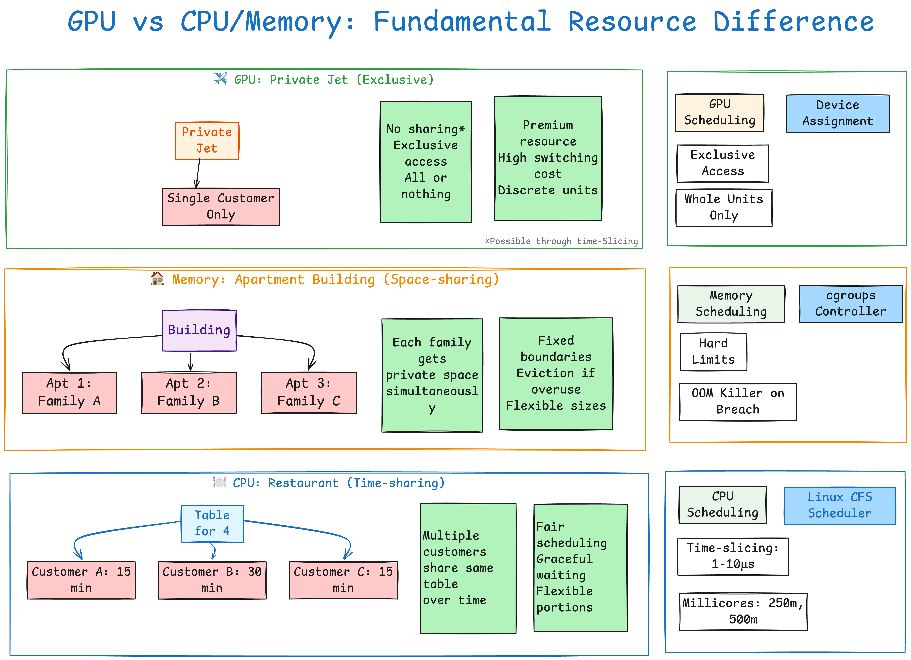

# Resource Discovery and Scheduling Patterns

## 1. Resource Discovery Pattern
- **CPU / Memory**  
  - Auto-discovered as native resources by the kubelet.  
- **GPU**  
  - Requires device plugins to be registered as extended resources.

## 2. Scheduling Complexity
- **CPU**  
  - Most complex: supports fine-grained time-slicing and fair scheduling.  
- **Memory**  
  - Moderate complexity: enforces hard limits and handles OOM (Out-Of-Memory) events.  
- **GPU**  
  - Simplest: allocated as whole units to pods (unless using MIG or time-slicing plugins).

## 3. Sharing Philosophy
- **CPU**  
  - Designed for multi-tenant sharing via millicore allocations.  
- **Memory**  
  - Isolated sharing through separate address spaces per container.  
- **GPU**  
  - Exclusive access by design (one GPU per container) unless specialized drivers enable slicing.

## 4. Failure Handling
- **CPU**  
  - Graceful degradation through throttling under contention.  
- **Memory**  
  - Abrupt termination via OOM killer when limits are exceeded.  
- **GPU**  
  - Behaves like application-level crashes; the container must handle GPU errors itself.  
